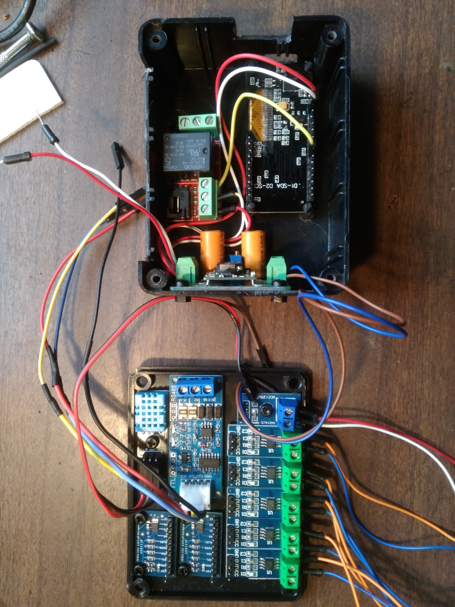
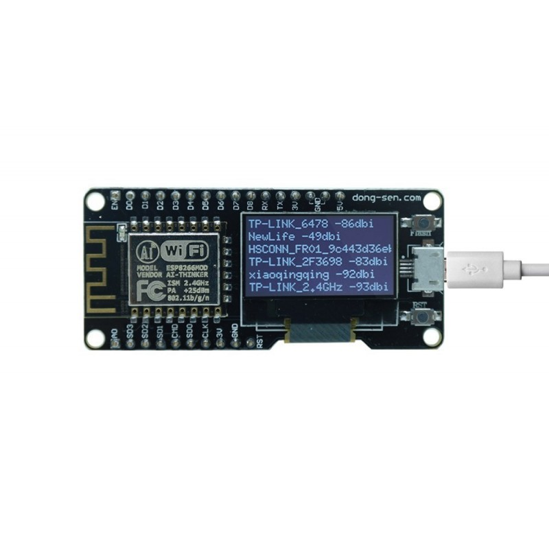
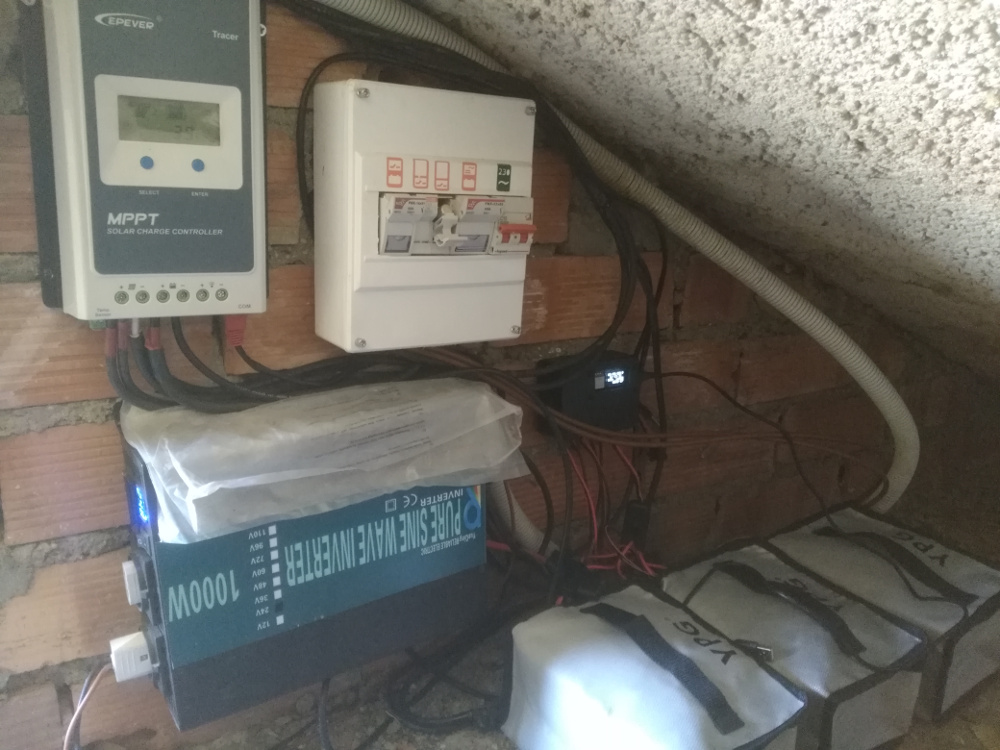

# BatAn
Battery Bank Analyzer

This is a project to monitor a Battery Bank (Lithium Battery Packs) in a solar installation. It also communicates with solar charger and calculates live values of power going to home and battery bank. It includes a web server with charts, internal historical data, and optionally, uploads data to Thingspeak and Blynk.

Hardware used:

- ESP8266 with OLED display board (Nodemcu, D-Duino?)  
- DHT11 Inside temperature and Humidity sensor
- DS18B20 external Temperature Sensor
- ADS1115 16 bit 4 channel Analog Input Boards (2x) (To read current and voltage sensors)
- ACS712 5V 20A Hall Effect current meters (5x)
- Voltage Sensor <25V Voltage Divider 5V
- DC-DC Voltage Converter Step-down Module 4-24V->5V (To supply ESP8266 board)
- Solid State Relay Module (optional, to control an AC Load via Web)
- TTL-to-RS485 Converter Module 3.3V-5V (To communicate with Solar Charger)
- Epever Tracer 2206AN (Solar Charger MPPT 20A)
- Lithium Battery Packs LiitoKala 24V 12ah (5x) (Lithium Battery Bank, total capacity 1250 wh)

