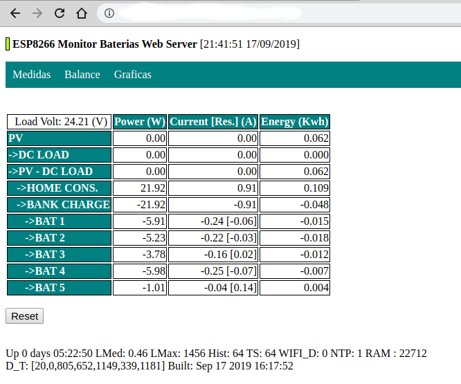
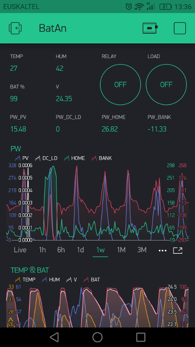
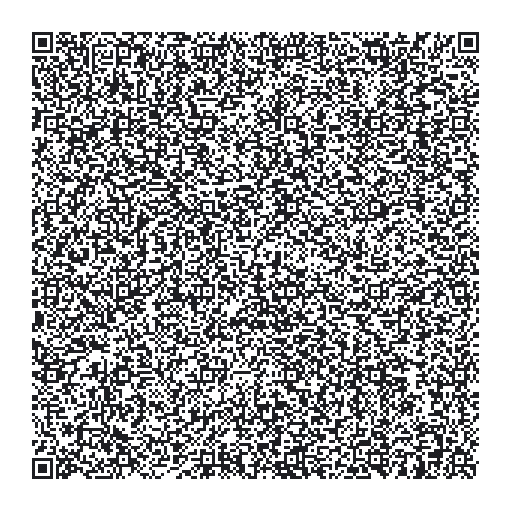
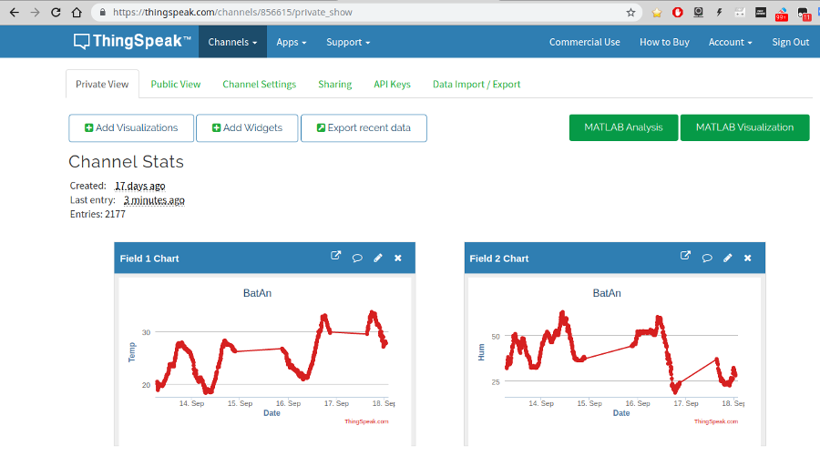

# BatAn
<strong>Battery Bank Analyzer</strong>

This is a project to monitor a Battery Bank (Lithium Battery Packs) in a solar installation. It traces current individually for each Battery Pack. It also communicates with solar charger and calculates live values of power going to home and battery bank. It includes a web server with charts, internal historical data, and optionally, uploads data to Thingspeak and Blynk.

<strong>Hardware used:</strong> <a href="photos/hardware/">see hardware pics</a>

- ESP8266 with OLED display board (Nodemcu, D-Duino?) 
- DHT11 Inside temperature and Humidity sensor
- DS18B20 external Temperature Sensor
- ADS1115 16 bit 4 channel Analog Input Boards (2x) (To read current and voltage sensors)
- ACS712 5V 20A Hall Effect current meters (5x) (*1)
- Voltage Sensor <25V Voltage Divider 5V
- DC-DC Voltage Converter Step-down Module 4-24V->5V (To supply ESP8266 board)
- Solid State Relay Module (optional, to control an AC Load via Web) (*2)
- TTL-to-RS485 Converter Module 3.3V-5V (To communicate with Solar Charger)
- Epever Tracer 2206AN (Solar Charger MPPT 20A)
- Lithium Battery Packs LiitoKala 24V 12ah (5x) (Lithium Battery Bank, total capacity 1250 wh)

(*1) Current sensors are rated 20A but probably is to much for sensor board. There are thermal switches for each battery pack limiting current to 10A. 5x10 = 50A, aprox. 1000 Watts maximum power.  
(*2) In pics is a regular relay but it was changed because coil interfered with hall current detectors.

<strong>ESP8266 Web server:</strong>

- Raw Measures from current meters and modbus Communication with charger:

  

- Power Distribution from Photovoltaic Panels to Home, Battery Bank and Packs:

  

- Chart Live Data:

  
  
- Chart Historical Data:

  
  
- Chart Historical Data Selected View (Bank & Packs):
  
  
  
<strong>Mobile App with Blynk</strong>
 
 

 1. Download Blynk App: http://j.mp/blynk_Android or http://j.mp/blynk_iOS
 2. Touch the QR-code icon and point the camera to the code below
 
 

<strong>ThingsPeak</strong>

Data is uploaded to ThingsPeak database for persistent historical records
 
 
 
---------------------------------------------------------------
This project is part of an experiment, to check the behaviour and lifetime of Li-ion battery packs (BMS included) connected in parallel in a solar installation. Lithium Chemistry used is not LiFePo4 3.65V/Cell , recommended for solar installations, but regular Li-ion batteries 4.2V/Cell, with more capacity and also risks. As can be seen in photos Battery Packs are inside safety bags bellow Battery Analyzer and everything is in the roof.

